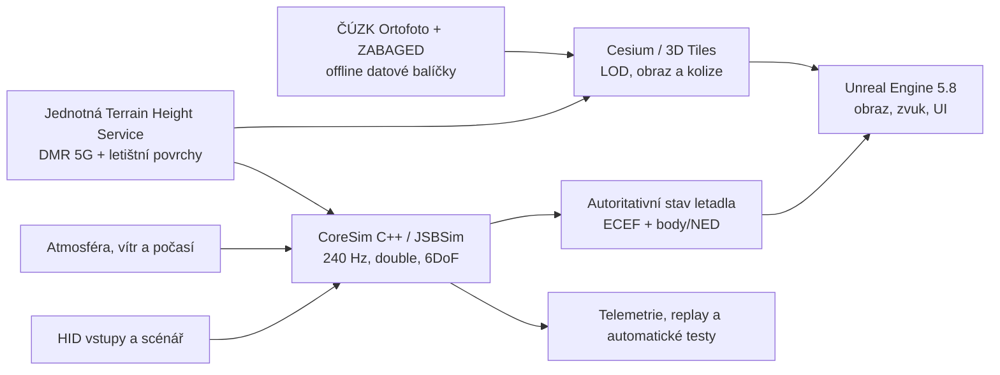

# AGENTS.md

## Project
- name: Flying
- repo: filipbcz/flying
- default branch: main

## Task
- title: Flying: 2. Establish Repository Build Skeleton
- prompt: Project: Flying

Parent objective:
# Technické zadání: realistická 3D letecká simulace pro Win64

**Stav dokumentu:** návrh realizovatelného zadání 1.1  
**Cílová platforma:** Windows 64-bit  
**Primární oblast verze 1:** Česká republika  
**Primární letadlo verze 1:** jednomotorový pístový cvičný letoun s dostupným POH a dostatečnými aerodynamickými daty  
**Charakter produktu:** desktopový simulátor s fyzikálně založenou letovou dynamikou; bez nároku na certifikaci výcvikového zařízení

## 1. Výsledné rozhodnutí

Simulace bude postavena na těchto základech:

- **Unreal Engine 5.8, C++** jako grafický, zvukový, UI a distribuční engine pro Win64.
- **Cesium for Unreal 2.28+** jako georeferenční a streamingová vrstva pro WGS‑84, ECEF, 3D Tiles a rastrové překryvy.
- **Samostatné C++ jádro letové dynamiky** běžící v pevném kroku 240 Hz a v dvojité přesnosti. Základem bude JSBSim; jeho model každého letadla musí být doplněn a ověřen proti datům konkrétního stroje.
- **ČÚZK DMR 5G** jako hlavní fyzický model reliéfu v ČR a **DMP 1G** jako pomocný zdroj výšek budov a vegetace.
- **ČÚZK Ortofoto ČR, ZABAGED a Geonames** jako jediný základ obrazu krajiny, vektorových objektů a vlastní 2D mapy. Data budou předzpracována do lokálních balíčků; produkt nebude závislý na externím mapovém API.
- **Samostatná letištní databáze** s přesnou geometrií všech aktivních letištních drah v ČR a všech ploch SLZ publikovaných ve VFR příručce. Fyzický povrch drah bude nezávislý na běžném terénním LOD.

Celý geografický obsah verze 1 je omezen na Českou republiku a je dostupný offline. Obrazová vrstva poskytuje barvu, DMR tvar krajiny a letištní databáze autoritativní geometrii a fyzikální vlastnosti pohybových ploch.

## 2. Produktový rozsah verze 1

Verze 1 musí dodat ucelenou simulaci letu nad celou Českou republikou s jedním detailně zpracovaným letadlem, denním/nočním cyklem, počasím, funkčním kokpitem, letišti a možností letu od cold-and-dark po vypnutí motoru.

### Povinný obsah

- let nad celou ČR bez přerušení načítací obrazovkou;
- jeden plně fyzikální jednomotorový pístový letoun;
- 3D kokpit se všemi ovladači nutnými k běžnému letu;
- start, pojíždění, vzlet, let, přetažení, vývrtková tendence, přistání a nouzové režimy;
- skutečná poloha na Zemi, délka/šířka, nadmořská výška, čas a sluneční poloha;
- vítr, nárazy, turbulence, tlak, teplota, hustota vzduchu, oblačnost a srážky;
- přesný terén, kolize, voda, zástavba a vegetace v úrovni odpovídající vzdálenosti od kamery;
- všechny aktivní letištní dráhy evidovaných letišť v ČR a všechny plochy SLZ publikované ve VFR příručce, včetně zpevněných i nezpevněných povrchů;
- vlastní offline 2D navigační mapa ČR bez externího mapového API;
- ovládání klávesnicí, myší, gamepadem a běžnými USB/HID leteckými ovladači;
- mapování os, dead zone, křivky odezvy a více profilů zařízení;
- ukládání scénáře, replay a export telemetrie;
- grafické profily včetně DLSS/TSR a škálování hustoty objektů;
- instalátor a podepsaný Win64 Shipping build.

### Výslovně mimo verzi 1

- certifikace EASA/FAA FSTD;
- multiplayer a řízení letového provozu více hráčů;
- jakékoli území mimo Českou republiku;
- dopravní letouny, vrtulníky a bojové systémy;
- kompletní avionika všech výrobců;
- VR a force feedback, pokud nebudou samostatně objednány;
- fotogrammetrická 3D města pro celé území.

## 3. Architektura

### Povinné oddělení subsystémů

1. **CoreSim** je samostatná knihovna bez závislosti na snímkové frekvenci a renderingu. Lze ji spustit headless v automatických testech.
2. **Geo/Terrain** zajišťuje převody souřadnic, výšku, normálu povrchu, typ povrchu a kolize. Stejný zdroj používá FDM i render, aby letadlo neplavalo nad zemí nebo se do ní nebořilo.
3. **Presentation** v Unreal Engine pouze zobrazuje autoritativní stav simulace, obsluhuje UI, kamery, zvuk a vizuální efekty.
4. **Data pipeline** mimo běžící hru převádí zdrojová GIS data do verzovaných, kontrolovaných terénních balíčků.
5. **Telemetry/Replay** ukládá vstupy, stav, síly, momenty, konfiguraci a verze dat tak, aby byl let reprodukovatelný.

Jádro kritické fyziky bude v C++; Blueprint je povolen pro prezentační logiku, nikoli pro rovnice pohybu, aerodynamiku, motor, podvozek nebo geodézii.

## 4. Souřadnice a přesnost Země

- Autoritativní globální souřadný systém: **ECEF na elipsoidu WGS‑84**, 64bit `double`.
- Lokální výpočty: lokální NED/ENU rámec a tělesový rámec letadla; převody nesmějí ztrácet dvojitou přesnost.
- Unreal pozice bude odvozena přes Cesium Georeference; vizuální origin se smí přesouvat, autoritativní ECEF stav nikoli.
- Zdroje S‑JTSK/Bpv nebo ETRS89/EVRS budou v offline pipeline transformovány přes PROJ a oficiální transformační/geoidní mřížky.
- Datový model musí odlišovat:
  - elipsoidickou výšku pro geometrii ECEF;
  - ortometrickou výšku nad střední hladinou moře;
  - tlakovou výšku, QNH/QFE a indikovanou výšku přístrojů.
- Jednotky uvnitř CoreSim jsou SI. Převody na kt, ft, inHg, hPa apod. jsou pouze na hranicích systému a v UI.

## 5. Geodata, terén, letiště a mapa

### 5.1 Výškový terén České republiky

Hlavní zdroj bude **DMR 5G**, který ČÚZK poskytuje jako LAZ/TIN. Uváděná úplná střední chyba výšky je 0,18 m v odkrytém a 0,30 m v zalesněném terénu. Offline pipeline provede:

1. stažení a kontrolu zdrojových dlaždic;
2. transformaci souřadnic a výškového systému;
3. odstranění vad, sjednocení hran a letištní korekce;
4. tvorbu hierarchického LOD terénu ve 3D Tiles/quantized-mesh;
5. tvorbu fyzických kolizních dlaždic v okolí letadla;
6. generování normál, masek vody, materiálů a metadat zdroje;
7. vytvoření manifestu s verzí, původem a kontrolními součty.

### 5.2 Obrazová a vektorová vrstva

Výchozí produkční varianta pro ČR:

- ČÚZK Ortofoto ČR, 0,125 m/pixel, CC BY 4.0;
- offline zpracování do více úrovní detailu;
- bezešvé hrany, mipmapy, sezónní a materiálové korekce;
- procedurální detail povrchu zblízka, protože samotná ortofotografie neposkytuje normály, objem vegetace ani fyzikální materiál.

Vektorové vrstvy budou vznikat primárně ze ZABAGED a Geonames. Obsahují silnice, železnice, vodstvo, zástavbu, významné objekty, vegetační plochy a názvy. DMP 1G slouží k odhadu výšek budov, porostu a překážek, nikoli jako fyzický model holého reliéfu. Každý výsledný balíček nese atribuci ČÚZK, verzi zdrojových dat a kontrolní součty.

### 5.3 Letiště, vzletové a přistávací dráhy

Pro dráhy, pojezdové plochy a stojánky se nepoužije samotný DEM. Vytvoří se samostatné georeferencované povrchy s vlastním meshem, kolizí, materiálem a LOD. Profil dráhy bude plynulý, ale nebude automaticky narovnán do jediné vodorovné roviny; musí zachovat skutečný podélný i příčný sklon.

#### Povinné pokrytí

- všechna aktivní civilní a vojenská letiště uvedená v aktuální Evidenci letišť ÚCL, pokud je jejich geometrie veřejně dostupná;
- všechna letiště publikovaná v AIP ČR a VFR příručce ČR;
- všechny plochy SLZ publikované ve VFR příručce, jasně označené jako SLZ a veřejné/neveřejné;
- uzavřená nebo dočasně nepoužitelná letiště zůstanou ve scéně jen tehdy, pokud fyzicky existují, ale nesmějí být nabízena jako výchozí místo bez explicitního historického režimu;
- letiště nebo dráha bez ověřených dat nesmí být v produkčním manifestu označena jako validovaná.

Evidence letišť ÚCL je hlavní kontrolní seznam úplnosti. AIP ČR je autoritativní zdroj pro letiště, která obsahuje; VFR příručka doplňuje ostatní VFR letiště a publikované plochy SLZ. Při rozporu má přednost aktuální AIP, následně aktuální VFR příručka a poté písemně potvrzená data provozovatele.

#### Datový model jedné dráhy

Každý záznam `Aerodrome/Runway/RunwayEnd` musí podle dostupnosti obsahovat:

- ICAO nebo lokální identifikátor, název, stav a kategorii letiště;
- označení obou směrů RWY, pravý a magnetický směr;
- přesné WGS‑84 souřadnice a výšky obou fyzických konců a obou prahů;
- délku, šířku, posunuté prahy, stopway, clearway, strip a RESA;
- publikované vzdálenosti TORA, TODA, ASDA a LDA pro každý směr;
- povrch, únosnost/PCN, podélný profil, příčný sklon a lokální nerovnosti;
- značení RWY, prahů, osy, aiming pointu, TDZ a okrajů;
- okrajová, prahová, koncová, osová a přibližovací světla, PAPI/VASI a jejich geometrii;
- fyzikální materiál pro suchý, mokrý, zasněžený a zledovatělý stav;
- zdroj každého údaje, datum účinnosti AIRAC, míru jistoty a stav manuálního ověření.

Geometrie se vždy staví od publikovaných souřadnic prahů. Nesmí se aproximovat pouze z ARP, názvu RWY a délky. Chybějící údaje lze získat geodetickým zaměřením, od provozovatele nebo odměřením z Ortofota ČR a DMR 5G; takto odvozené hodnoty musí být označeny jako odvozené a projít vizuální kontrolou.

Offline importér bude verzovat data podle AIRAC, vytvoří rozdílový report a nepovolí automatické přepsání ručně ověřené geometrie bez kontroly. AIP/VFR obsah se nesmí automaticky přebírat ani redistribuovat bez písemného souhlasu ŘLP ČR/AIM, protože běžné podmínky webu omezují použití obsahu v jiných produktech. Pokud souhlas nebude udělen, použijí se údaje přímo získané od provozovatelů a vlastní geometrie odvozená z otevřených dat ČÚZK.

#### Úroveň zpracování letišť

- **Všechna zahrnutá letiště:** přesná RWY, fyzika povrchu, značení odpovídající kategorii, větrný rukáv, bezpečné startovní body a bezkolizní napojení na okolní terén.
- **Detailní letiště:** navíc pojezdové dráhy, stojánky, odbavovací plochy, světelná soustava, značky, terminály, hangáry a významné překážky. Seznam detailních letišť je samostatný obsahový manifest; minimálně musí zahrnout všechna řízená veřejná letiště a letiště použité ve validačních scénářích.
- **Plochy SLZ:** skutečný travnatý nebo jiný publikovaný pás, sklon, povrch, větrný rukáv a překážky důležité pro přílet a odlet; nebudou automaticky vybaveny prvky letiště podle ICAO L14.

### 5.4 Vlastní offline navigační mapa

2D mapa bude vyrenderována z lokální vektorové databáze ZABAGED/Geonames a leteckých vrstev, pro které má projekt oprávnění. Použije vektorové tiles v lokálním MBTiles nebo PMTiles balíčku, vlastní styl a přepínatelné vrstvy letišť, RWY, překážek a vzdušných prostorů. Za běhu nebude vyžadovat internet, API klíč ani veřejný tile server.

## 6. Letová fyzika

### 6.1 Základní model

- nelineární šestistupňové rovnice pohybu tuhého tělesa;
- plný tenzor momentu setrvačnosti, hmotnost a těžiště měněné palivem a nákladem;
- WGS‑84 tvar a rotace Země, gravitace, Coriolisova a odstředivá složka;
- atmosféra ISA 1976 s odchylkou teploty, tlaku a vlhkosti;
- aerodynamické síly a momenty jako funkce úhlu náběhu, úhlu skluzu, Machova a Reynoldsova čísla, úhlových rychlostí, výchylek řízení, konfigurace a ground effectu;
- nelineární oblast přetažení, hystereze, autorotace a post-stall chování, pokud existují validační data;
- pístový motor, směs, otáčky, plnicí tlak, teploty, spotřeba, vrtule, gyroskopické a P-factor účinky;
- podvozek, tlumiče, pneumatiky, diferenciální brzdy, boční síla, tření podle povrchu, aquaplaning jen pokud bude model podložen daty;
- poškození a poruchy založené na překročení limitů, nikoli na náhodném odečítání „health points“.

CoreSim poběží standardně na 240 Hz s akumulátorem času. Při zpoždění renderu nesmí změnit fyzikální výsledek. Režim zrychlení času smí měnit počet kroků, ne délku fyzikálního kroku mimo ověřený rozsah.

### 6.2 Data letadla

„Reálná fyzika“ nevznikne pouze implementací Newtonových zákonů. Vyžaduje skutečná data konkrétního letadla:

- geometrii nosných ploch a řídicích ploch;
- hmotnosti, těžiště a momenty setrvačnosti;
- aerodynamické derivační koeficienty včetně nelineárních tabulek;
- mapy motoru a vrtule;
- převody, vůle, limity a rychlosti aktuátorů;
- data podvozku a brzd;
- POH/AFM, letové zkoušky nebo validované CFD/wind-tunnel podklady.

Model nesmí být označen jako věrný konkrétnímu typu, dokud neprojde validačním balíkem. Přibližný komunitní model JSBSim lze použít pro vývoj infrastruktury, ne jako důkaz fyzikální věrnosti.

### 6.3 Přístroje a avionika

Přístroje nebudou číst „pravdivý“ stav simulace přímo. Pitot-statické přístroje, kompas, gyroskopy, motorové ukazatele a GPS dostanou vlastní senzorový model s dynamikou, chybami, námrazou/ucpáním a elektrickými závislostmi. Elektrická, palivová a vakuová soustava musí být řešena jako síť se stavem, spotřebiči a poruchami.

## 7. Atmosféra a počasí

- konzistentní 3D pole větru sdílené fyzikou, částicemi, vegetací a zvukem;
- vertikální profil větru, střih, termika, orografické proudění a závětří;
- nárazy a turbulence podle Drydenova nebo von Kármánova modelu;
- hustota, tlak, teplota a vlhkost ovlivňují vztlak, odpor, motor, vrtuli a přístroje;
- mraky, srážky, dohlednost, námraza a mokrý povrch musí mít fyzikální dopad, pokud jsou v UI zapnuté;
- scénář dovolí ruční počasí a import reálného METAR/GRIB jako volitelného datového adaptéru;
- vizuální mrak nesmí být jediným modelem počasí; CoreSim dostává numerická data nezávislá na renderu.

## 8. Svět a vizuální obsah

- fyzikálně založené materiály, Lumen/Nanite tam, kde neohrozí stabilní výkon;
- procedurální rozmisťování vegetace a budov podle otevřených vektorových dat, nikoli podle barev ortofota samotného;
- objekty kritické pro let: dráhy, značení, světla, větrné rukávy, překážky, stožáry a elektrická vedení;
- zástavba a vegetace mají kolize jen v aktivní bezpečnostní zóně kolem letadla;
- obzor a vzdálený terén musí zůstat stabilní bez viditelného „poppingu“;
- kokpit používá čitelné textury, správné materiály skla, stíny a noční podsvícení;
- zvuk motoru je řízen otáčkami, zatížením, vrtulí, směsí, kabinou, prouděním a poškozením.

## 9. Uživatelský tok

1. Uživatel zvolí letadlo, letiště/pozici, datum, čas, počasí, hmotnost, palivo a poruchy.
2. Simulace ověří dostupnost požadovaných terénních balíčků a dat.
3. Let začne ve zvoleném stavu: cold-and-dark, ready-to-taxi nebo airborne.
4. Uživatel může přepínat kokpitovou a externí kameru, otevřít 2D mapu a zobrazit diagnostiku.
5. Po letu je dostupný replay, mapa trasy, grafy letových veličin a export CSV/JSON.

Veškeré mapové a letištní podklady jsou součástí verzovaných offline balíčků. Síť je nutná pouze pro explicitně spuštěnou aktualizaci dat nebo volitelné živé počasí; výpadek sítě nesmí znemožnit běžný let.

## 10. Nefunkční požadavky

### Výkon na referenční sestavě

Referenční sestava: 8jádrové moderní CPU, 32 GB RAM, GPU třídy RTX 4070 s 12 GB VRAM, NVMe SSD, Windows 11 x64.

- nejméně 60 FPS při 2560×1440 v profilu High nad běžnou krajinou;
- 1% low nejméně 45 FPS;
- CoreSim bez vynechaného kroku při 240 Hz;
- vstupní latence řízení pod 50 ms při 60 FPS;
- žádný hitch delší než 100 ms při běžném streamingu;
- spuštění do menu do 20 s z NVMe;
- přechod ze scénáře do kokpitu do 30 s pro již nainstalovanou oblast;
- paměťový limit 24 GB RAM a 10 GB VRAM v profilu High;
- pád aplikace při desetihodinovém automatickém letu je nepřípustný.

### Kvalita, bezpečnost a provoz

- deterministický replay při stejné verzi CoreSim, dat a vstupů;
- verzované schéma konfigurací letadel a terénních manifestů;
- automatická validace všech externích dat před importem;
- žádné síťové stažení mimo explicitně povolené domény;
- telemetrie je opt-in a nesmí obsahovat osobní údaje bez souhlasu;
- SBOM a přehled licencí všech knihoven a dat v každém vydání;
- minidump, strukturovaný log a jednoznačné ID buildu pro diagnostiku;
- ukládání nastavení a save dat je atomické a odolné proti poškození.

## 11. Ověření fyziky a akceptace

### Automatické testy CoreSim

- zachování energie a hybnosti v syntetických stavech bez vnějších sil;
- správnost transformací ECEF, geodetických, NED a tělesových souřadnic;
- atmosféra, gravitace a převody jednotek proti referenčním hodnotám;
- trim pro vodorovný let, stoupání, klesání a zatáčku;
- opakovatelnost výsledku bez závislosti na FPS;
- kontakt podvozku s rovinným, skloněným a nerovným povrchem;
- záznam a přehrání letu s kontrolním hashem stavů.

### Validační letový balík

Při přesně definované hmotnosti, těžišti, konfiguraci a atmosféře se změří a porovná minimálně:

- pádová rychlost v čisté a přistávací konfiguraci: odchylka nejvýše ±3 %;
- maximální rychlost a cestovní výkony: ±3 %;
- rychlost stoupání a dostup: ±5 %;
- klouzavost a opadání: ±5 %;
- délka vzletu a přistání: ±10 %;
- otáčky, výkon, spotřeba a teploty motoru ve zvolených bodech: ±5 %;
- statická a dynamická stabilita: správné znaménko, mód a časové konstanty v toleranci validačních dat;
- odezva na skok kormidla/křidélek/výškovky a koordinovaná zatáčka;
- ground effect, boční vítr, smyk pneumatik a brzdění.

Tolerance platí jen tam, kde existují věrohodná referenční data. Každý test uloží vstupy, výstupy, zdroj referenční hodnoty a graf odchylky. Neúspěšný povinný test blokuje vydání.

### Terén, obraz a letiště

- kontrolní body DMR 5G: výška v interní Terrain Height Service se po transformaci neliší od zdroje o více než 0,10 m nad chybu zdrojových dat;
- vizuální a fyzický povrch se v aktivní zóně liší nejvýše o 0,10 m mimo záměrné objekty;
- hrany sousedních dlaždic nemají trhlinu ani výškový schod;
- automatický coverage report vykáže nulový počet chybějících aktivních letišť a RWY proti schválenému master seznamu ÚCL/AIP/VFR;
- souřadnice publikovaného prahu se po importu liší od zdroje nejvýše o 1 m, pravý směr nejvýše o 0,1° a rozměry nejvýše o 0,5 m;
- vizuální okraj RWY se tam, kde je patrný na Ortofotu ČR, liší nejvýše o 0,5 m; větší vědomá odchylka musí mít zapsaný důvod a schválení;
- vizuální a kolizní povrch RWY se v prostoru kol podvozku liší nejvýše o 0,05 m a při změně LOD nesmí skokově změnit výšku nebo normálu;
- TORA, TODA, ASDA, LDA, posunuté prahy, značení a světla odpovídají účinné verzi zdroje;
- fyzikální test na každém typu povrchu ověří rozjezd, brzdění, boční smyk a přechod mezi RWY a okolním terénem;
- přechod LOD nezpůsobí skok kolizního povrchu pod letadlem;
- povinná atribuce zdrojů je viditelná v aplikaci a v dokumentaci.

## 12. Milníky a předávky

### M0 — právní a datový gate

- potvrzené použití otevřených dat ČÚZK a přesná podoba atribuce CC BY 4.0;
- písemný souhlas ŘLP ČR/AIM s automatizovaným importem, zpracováním a distribucí potřebných údajů z AIP/VFR, nebo schválený náhradní proces získání dat od provozovatelů a z ČÚZK;
- zmrazený master seznam aktivních letišť, drah a publikovaných ploch SLZ pro první vydání;
- potvrzené licence letadla, značek, POH/AFM a všech fyzikálních dat;
- seznam zdrojů GIS dat a požadovaných atribucí;
- výběr konkrétního referenčního letadla.

**Go/No-Go:** Bez oprávnění k AIP/VFR se jejich obsah nesmí převzít do produktu; dráhy se vybudují z otevřených dat ČÚZK a písemně potvrzených podkladů provozovatelů. Bez validačních dat letadla nelze slíbit věrnost konkrétního typu.

### M1 — vertikální řez

- Win64 build UE 5.8 + Cesium;
- 50 × 50 km oblast s DMR 5G, ortofotem, jedním zpevněným a jedním travnatým letištěm a bezchybným LOD;
- funkční runway importér, datové schéma a první coverage report;
- CoreSim/JSBSim běžící headless i v UE;
- vzlet, okruh a přistání s telemetrií a replay;
- základní výkonové a terénní testy.

### M2 — fyzikálně úplné letadlo

- všechny aerodynamické tabulky, motor, vrtule, podvozek, hmotnost a systémy;
- funkční kokpit a senzorové modely;
- dokončený validační letový balík;
- poruchy a krajní letové režimy podle dostupných dat.

### M3 — celá ČR

- verzované terénní balíčky celé republiky;
- všechny dráhy schváleného master seznamu, publikované plochy SLZ a překážky důležité pro vzlet a přistání;
- nulový počet chybějících aktivních RWY v coverage reportu;
- počasí, den/noc, vegetace, zástavba, voda a zvuk;
- stabilní dlouhé lety a splnění výkonových limitů.

### M4 — release candidate

- instalátor, podepsání, aktualizace a obnova dat;
- QA matice podporovaných zařízení a GPU;
- licence, atribuce, SBOM a uživatelská dokumentace;
- všechny povinné testy zelené a desetihodinový soak test bez pádu.

## 13. Povinné výstupy dodavatele

- zdrojový kód UE projektu, CoreSim a nástrojů datové pipeline;
- reprodukovatelný build pro Win64;
- verzované konfigurační soubory letadla a jejich schéma;
- verzovaná letištní databáze, runway importér, master seznam a coverage report;
- zdrojové odkazy, licence a transformační protokol GIS dat;
- automatické unit, integration, regression a performance testy;
- validační zpráva letadla a terénu;
- technická dokumentace architektury a provozní dokumentace;
- editor/scenario tool pro interní tvorbu a testování letů;
- instalační balíčky terénu a jejich manifesty;
- seznam známých omezení, který nesmí zamlčovat neověřené části modelu.

## 14. Definice hotového produktu

Produkt je hotový pouze tehdy, když lze na čisté podporované instalaci Windows 11 nainstalovat simulátor a český terén, zvolit libovolné aktivní letiště ze schváleného master seznamu, spustit cold-and-dark let, nahodit motor, odpojit brzdu, odpojíždět, vzlétnout, provést navigační let přes streamované území, přistát na jiném zahrnutém letišti, vypnout letadlo, přehrát let a exportovat telemetrii; současně coverage report neobsahuje chybějící RWY a jsou splněny výkonové, fyzikální, terénní, licenční a stabilitní akceptační testy tohoto dokumentu.

## 15. Ověřené zdroje a licenční poznámky

- [ČÚZK DMR 5G](https://geoportal.cuzk.cz/Default.aspx?metadataID=CZ-CUZK-DMR5G-V&mode=TextMeta&side=vyskopis)
- [ČÚZK Ortofoto ČR](https://geoportal.cuzk.cz/Default.aspx?metadataID=CZ-CUZK-ORTOFOTO-R&mode=TextMeta&side=ortofoto)
- [Otevřená data ČÚZK a CC BY 4.0](https://geoportal.cuzk.cz/Default.aspx?mode=TextMeta&text=data_uvod)
- [Formy poskytování DMR, DMP, ZABAGED, Ortofota a Geonames](https://geoportal.cuzk.cz/Dokumenty/Formy_poskytovani_dat_ZU.pdf)
- [Evidence letišť ÚCL](https://www.caa.gov.cz/letiste/evidence-letist/)
- [Aktuální eAIP ČR](https://aim.rlp.cz/eaip/html/LK-cover-cz-CZ.html)
- [VFR příručka ČR – letiště a plochy SLZ](https://aim.rlp.cz/vfrmanual/index_cz.html)
- [Podmínky užití webu AIM](https://aim.rlp.cz/?lang=cz&p=podminky-uziti)
- [Datové sady terénu a překážek AIM](https://aim.rlp.cz/?lang=cz&p=datasets)
- [Datové sady geografických zón AD/SLZ/HEL](https://aim.rlp.cz/index.php?lang=cz&p=uas-gz)
- [Unreal Engine 5.8 release notes](https://dev.epicgames.com/documentation/unreal-engine/unreal-engine-5-8-release-notes)
- [Unreal Engine Large World Coordinates](https://dev.epicgames.com/documentation/unreal-engine/large-world-coordinates-in-unreal-engine-5)
- [Cesium for Unreal](https://github.com/CesiumGS/cesium-unreal)
- [Cesium pro Unreal – raster overlay a podporované formáty](https://cesium.com/learn/unreal/unreal-faq/)
- [JSBSim Reference Manual](https://jsbsim-team.github.io/jsbsim-reference-manual/)
- [JSBSim zdrojový projekt a licence](https://github.com/JSBSim-Team/jsbsim)
- [Aktuální licenční model Unreal Engine](https://www.unrealengine.com/eula/unreal)

Licenční shrnutí je technické doporučení, nikoli právní stanovisko.

Current implementation step:
2. Establish Repository Build Skeleton

Step description and scope:
Add the initial repository structure, build presets, dependency documentation, CI entry points, and empty module boundaries for CoreSim, Geo/Terrain, Data Pipeline, Unreal presentation, tests, tools, and documentation.

In scope:
- Directory layout
- CMake or equivalent native build presets
- Initial CI scripts
- Dependency/version manifest
- Empty module scaffolding
- Initial smoke test

Out of scope:
- Flight dynamics implementation
- GIS processing implementation
- Airport importer implementation
- Unreal gameplay features
- Real aircraft data

Execution boundary:
- Implement only the current step and its acceptance criteria.
- Do not implement work assigned to future roadmap steps.
- Reuse existing functionality. If part of this step is already satisfied, verify it instead of rewriting it.
- Keep unrelated repository files unchanged.

Already completed roadmap steps (existing repository context):
- 1. Freeze Product Scope And Legal Data Gate

Future roadmap steps (explicitly out of scope):
- 3. Implement CoreSim Fixed-Step Kernel
- 4. Implement Geodesy And Units Library
- 5. Integrate JSBSim Into CoreSim
- 6. Build Terrain Height Service Contract
- 7. Create GIS Data Pipeline Foundation
- 8. Implement DMR 5G Terrain Processing For Pilot Region
- 9. Implement Ortofoto And Vector Package Processing For Pilot Region
- 10. Implement Airport Master List And Runway Schema
- 11. Implement Runway Importer And Pilot Airport Surfaces
- 12. Create Unreal UE 5.8 Project And Cesium Runtime Integration
- 13. Implement Input Device Mapping And Scenario Start Flow
- 14. Implement Telemetry, Replay, And Export V1
- 15. Build Vertical Slice Flight And Performance Tests
- 16. Complete Production Aircraft Data Model
- 17. Implement Aircraft Systems And Sensor Models
- 18. Implement Cockpit And Aircraft Presentation
- 19. Implement Weather And Atmosphere Coupling
- 20. Build Aircraft Validation Suite
- 21. Scale Terrain Pipeline To Full Czech Republic
- 22. Complete Airport And SLZ Coverage
- 23. Implement Detailed Airport Set
- 24. Implement Offline 2D Navigation Map
- 25. Implement World Objects, Vegetation, Water, Obstacles, And Audio
- 26. Implement Save, Scenario Editor, Diagnostics, And Failure Workflows
- 27. Optimize Performance And Long-Run Stability
- 28. Implement Packaging, Installer, Signing, Updates, And Crash Diagnostics
- 29. Produce Licensing, SBOM, Documentation, And Release Evidence
- 30. Execute Release Candidate Acceptance Gate

Acceptance Criteria:
- Repository has separate top-level areas for CoreSim, Geo/Terrain, data pipeline tools, Unreal project integration, tests, documentation, packaging, and third-party notices.
- Build configuration defines named development, test, and Win64 packaging presets without requiring external map APIs or runtime network credentials.
- CI or local validation entry point can build empty/native modules and run an initial smoke test successfully.
- Dependency manifest records intended versions for Unreal Engine 5.8, Cesium for Unreal 2.28+, JSBSim, PROJ, test framework, packaging tools, and signing requirements.
- mode: full_auto
- max iterations: 10
- max budget: 5 USD

## Agent Configuration
- no project config provided, using defaults